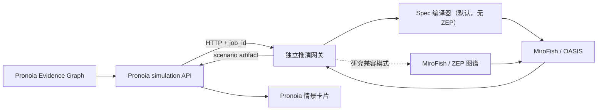

# Pronoia × MiroFish 多智能体事件推演（实验性）

> 状态：Draft / scenario-only。当前功能用于发现和审阅未来情景，不输出校准概率，
> 不构成投资建议。

## 接入目标

Pronoia（仓库名 FEVER）的证据图擅长沉淀“截止当前已经知道什么”；事件预测员（`@predictor`）在其后增加一个可选步骤，
让事件主体、机构投资者、监管机构、媒体、上下游等参与方根据同一组有来源的事实采取行动，
再把行动汇总为带触发条件、可能后果和失效条件的情景分支。

推演通常耗时数分钟，因此它不进入普通聊天或 skill 的同步请求，而是通过持久化异步任务运行。



## 本 PR 包含什么

- `simulation_jobs` SQLite 任务表及幂等结果回写；
- 推演创建、状态查询、任务列表、取消和参与方预览 API；
- 刷新后恢复运行任务，终态结果只写入一件 `simulation` 产出物；
- 主规划器派出 `predictor` 且证据图通过入口校验时自动启动，缺图时安全跳过；
- 4/6/8/10 档自动参与方预算，以及手动上限；
- 运行前展示参与方与入选原因；
- 情景分支、触发条件、可能后果、失效条件和执行摘要界面；
- scenario-only 与非投资建议提示；
- 后端接口回归测试和前端生产构建验证。

## 当前仓库边界

本 PR 是 **Pronoia/FEVER 侧客户端与任务编排集成**。它要求一个实现下述契约的独立推演网关运行在
`FEVER_SIMULATION_GATEWAY_URL`。网关参考实现目前位于配套 FEVER-MiroFish 实验工作区，
尚未复制进本仓库；Draft 阶段希望维护者确认最终采用以下哪种交付方式：

1. 将网关作为 FEVER 仓库内的可选独立服务；
2. 将网关发布为单独仓库/版本，并由 FEVER 锁定兼容版本。

保持 HTTP 进程边界也能避免把 MiroFish 的 AGPL-3.0 源码直接并入 FEVER 的 MIT 模块。
最终发布方式和许可证说明应在转为 Ready for Review 前确认。

## 配置与使用

2026-09-12 上游同步：集成分支已合入 `main` 的 `7857afb`（Pronoia 3.12.1）。推演任务表、接口和聊天交接与新增前瞻评估共同保留；Navigator 补查完成后，最终证据图可启动一次后台推演。

后续观察条件检查在三例固定输出上将待核对提示由 8/44 扩至 19/44，新增 11 条涉及消息缺失或内部动作的提示；未新增模型调用，不作为生成质量或预测准确率指标。历史观察窗口保留原始起止日期。独立复算见 [观察条件检查](../backtesting/mirofish_observation_review_v1/README.md)，具名主体与此前真实模拟结果见 [完整实验记录](../backtesting/mirofish_real_scenarios_v2/README.md)。默认保持 v7。

2026-09-12 真实案例检查：比亚迪中报、国泰君安/海通重组以及服务中断共完成五次运行。
网关修复了毛利率误触发利率政策的选角错误，为运营中断补充客户、供应商等角色，并减少窗口日期的数值误报。
真实输出仍存在无依据的精确期限、主体未拆分及信号获取渠道不合适的问题；请将结果作为需要复核的研究草稿。
原始输出、修正前后对照和具体建议见 [真实场景结果包](../backtesting/mirofish_real_scenarios_v1/README.md)。

2026-09-07 更新：默认保留简洁生成，新增当前决策展示、统一观察窗口、数值核对与参与方遗漏提示。复制清单会保留核对提示。详细未来响应的试跑暴露出过度细化问题，暂未切为默认。实际验收步骤见 [用例验收](mirofish-acceptance.md)。

24 案例生成回归中，简洁 v7 的有效产物为 24/24，详细 v8 为 11/24；成功产物的编译耗时中位数分别为 60.3 秒、176.7 秒。
先导模型评审未通过可靠性检查，因此不作质量改善结论。匿名输入、全部调用记录、失败原因和离线复算入口见
[产品迭代 v2 结果包](../backtesting/mirofish_product_usability_v2/README.md)。

2026-09-06 产品更新：现在可以选择未来 7／30／90 天的观察窗口，在预览中查看参与方关注点，
并从情景结果一键复制观察清单。每条情景展示参与方、触发与重新判断条件，支持展开引用资料。
恢复原任务和重新推演有独立入口；进度查询断开后会自动重试。重新推演创建新任务，运行中的
相同任务仍复用。产品 v7 编译器支持十角色进入四条短情景链，并筛选、去重互动输入；原始记录保留。
已知晚于截止时间的证据会被排除，缺少时间记录的资料会在预览和结果中提示。

十角色离线结构检查达到 10/10 覆盖；复用 12 个封存案例的输入，修正转换后的点赞类型后，互动记录从 190 条筛到 78 条，
完整编译提示文本缩短约 14.6%。这些是结构与输入体积检查，不代表新版生成质量或预测能力提高。

后续真实模型对照比较“仅结构化决策、过滤互动、原始互动”：12 案例共 36 组情景全部完成生成，
经历 5 次格式重试，已有有效决策角色覆盖均为 100%。共 113 次调用（含 72 次评审），供应商估算费用约 0.02855 美元。
过滤组首次请求输入 token 减少约 14.4%，但本轮计入重试后的生成费用和耗时没有下降；评审标签一致率
约 67%，不足以确认质量优势。匿名输入、输出、原始评分、逐请求用量和无模型复算入口位于
[产品输入实验结果包](../backtesting/mirofish_product_usability_v1/README.md)。

对于只有一条简短证据的输入，预览和结果会提示补充公告正文、关键条款或数值，仍可正常推演。
此前互动轨迹消融的匿名材料与独立复算脚本见
[`backtesting/mirofish_trace_ablation_v1/`](../backtesting/mirofish_trace_ablation_v1/)。

在 `.env` 中配置：

```dotenv
FEVER_SIMULATION_GATEWAY_URL=http://127.0.0.1:5010
FEVER_SIMULATION_GATEWAY_TIMEOUT=15
```

在 FEVER-MiroFish 配套工作区中可用 `make start` 一次启动 MiroFish、兼容网关和 FEVER，
用 `make status`、`make logs-local` 和 `make stop` 管理后台服务。若独立部署 FEVER，仍需先
配置并启动符合下述 HTTP 契约的兼容网关。团队运行时，勾选事件预测员表示允许主规划器调度它；
若最终计划包含 `predictor`，深度研究者产出的证据图一旦落库并通过校验，后台推演会在团队运行过程中自动启动；
随后事件预测员继续读取研究交接，团队完成最终综合与复核。
没有证据图或图不满足入口契约时，界面会明确显示“安全跳过”，不会强行调用模型。

证据图详情中的“事件预测员 · 多智能体事件推演”面板仍保留手动入口，可用于重跑或控制参与方上限：

1. 在“事件预测员 · 多智能体事件推演”中选择“自动推荐”；
2. 免费预览选中的参与方和入选原因；
3. 启动单次推演（默认无 ZEP 路径实测约 2 分钟，聊天结束后仍会在后台继续）；
4. 等待后台任务完成，或安全取消；
5. 在右侧产出物中查看情景卡片。

手动选择 4/6/8/10 表示数量上限；角色可以来自证据提及或事件结构假设，预览会说明入选理由。

## 网关契约

### 运行前预览

`POST /v1/simulations/preview`

只编译证据图和参与方，不调用模型。返回自动预算、实际参与方和每个角色的入选原因。

### 创建任务

`POST /v1/simulations`

请求核心字段：

```json
{
  "case_id": "case_123",
  "source_graph_artifact_id": "artifact_123",
  "evidence_graph": {},
  "as_of": "2026-08-05T10:00:00+08:00",
  "horizon_days": 30,
  "mode": "quick",
  "max_actors": null
}
```

`max_actors=null` 表示自动推荐；整数仅允许 4～10。当前 FEVER API 只开放 `quick`。

### 查询与取消

- `GET /v1/simulations/{job_id}`
- `POST /v1/simulations/{job_id}/cancel`
- `POST /v1/simulations/{job_id}/resume`

网关状态至少包含 `status`、`stage`、`progress`、`error`、`finished_at` 和终态 `result`。
FEVER 接受 `completed` 或 `partial` 的结果；`failed`、`cancelled` 只更新任务状态，不创建结果产出物。
若少于两个参与方产出有效结构化决策，网关返回带原因的 `partial` 结果并保留过程审计，
不会伪造多主体情景，也不会把最后的场景编译前置条件误报为系统故障。

## 解释边界

- 证据图中的 source-backed evidence 才能成为模拟事实；claim 和 missing 不得伪装成事实；
- 模拟行动和模型生成的角色判断属于 simulated claims，不会回写为 evidence；
- 单次情景频率和内部一致性不是现实发生概率；
- 当前未开放 calibrated/B3，因为 FEVER predictor 尚未输出逐 target 的结构化 B1；
- 参与方越多不代表结果越好，自动预算用于在利益相关方覆盖、耗时和活跃度之间折中。
- `quick` 是兼容保留的内部模式值，界面对外称为“单次推演”；采用 2 个抽象互动轮次并限制证据文本预算，
  默认直接从 FEVER 证据图编译角色与 OASIS 配置，不要求 ZEP；正式实验的多种子、多轮设置与此产品入口分开执行。

## ZEP 依赖与当前数字

快速产品路径不再把 ZEP 作为硬依赖。一次 58 片段的真实批次在 10 分钟窗口内仍未完成，
但稍后远端状态为成功（116 节点、267 条关系），说明当次失败是固定超时造成的误报，
也说明云端图谱入库是交互时延瓶颈。兼容路径仍保留，并将等待窗口扩展到 30 分钟；
默认路径直接从 Pronoia 证据图生成 5 个金融参与方，真实新能源汽车案例得到：

- 5 / 5 活跃参与方；
- 5 / 5 有效结构化决策；
- 14 个自主行动、4 个可审查情景分支；
- OASIS 推演约 45 秒，连同情景汇总约 2 分钟完成。

已有冻结历史实验可作为第一版效果数字，而不是把单个演示案例包装成回测。12 个独立历史事件、
24 个二元目标、每例 3 个种子的 v7-C 实验中，B1 平均 Brier 为 0.15729，B3 为 0.15247，
相对改善约 3.06%；方向准确率两者同为 52.78%（B3 按预注册规则不改市场方向）。
12 个事件中 5 个改善、6 个不变、1 个变差。该结果达到开源项目的描述性决策级别，
即 11 / 12 个事件未变差；在推演实际改变概率的 9 个目标中，8 个 Brier 误差下降。
后一个 8 / 9 是条件诊断指标，不是 88.9% 的预测准确率。样本仍小，不能宣称稳定超越
基线或形成可交易收益。

2026-09-01 又完成了角色规模实验：CN/US 六类事件共 24 个主样本，以及 4 组同事件
4/6/8 角色消融，合计 32 次唯一推演，全部完成。4、6、8 角色的实际活跃率均为 100%，
主样本有效决策率为 97.0%，中位 / P90 耗时为 79.5 / 99.5 秒，平均估算成本约
$0.0041/次。相同事件从 4 增加到 8 个角色时，自主行动从 10.50 增至 23.75，
但最终情景覆盖角色数仅从 4.00 增至 4.25，说明下一处瓶颈是情景汇总而非角色调度。

2026-09-02 针对该瓶颈增加 coverage-balanced compiler v6，并在未参与问题定位的另外 4 个
八角色案例上，使用相同密封行动做留出对照。配置角色覆盖率从 v5 的 43.8% 提升到 96.9%
（+53.1 个百分点、2.21 倍），有效决策角色覆盖率达到 100%，结构完整率保持 100%。
一个案例有 1 个角色的结构化决策生成失败，因此系统没有把缺失决策的角色强行写入情景。
新增验证只调用模型 4 次，估算成本 $0.0025，中位情景编译耗时 35.8 秒。

2026-09-04 按预先固定的穷举规则，把留出范围扩大到未参与策略开发的全部 20 个主实验
事件，覆盖 CN/US、六类事件以及 4/6/8 三档角色规模。v5 遗漏 31 / 108 个有效决策角色，
v6 遗漏 0 / 108，遗漏减少 100%；20 / 20 个案例覆盖全部有效决策角色，结构完整率保持
100%。其中 16 个是本轮新案例，4 个复用前次相同输出；本轮增量费用估算约 $0.0075，
单案例中位情景编译耗时 37.8 秒。

同批事件池的数据审计发现重复载荷和占位文本较多，因此 T+3 市场方向只执行了 6 例开发
资格赛；推演没有改变方向，却令三分类 Brier 从 0.635 恶化到 0.949，资格赛未通过并按规则
停止。这不推翻上面的历史事件概率结果，但明确限制了结论：当前可说明工程稳定和行动覆盖，
不能说明已改善市场方向预测。冻结清单、逐次记录、图和标准库复算脚本见
[`backtesting/mirofish_actor_scale_v1/`](../backtesting/mirofish_actor_scale_v1/)。

## 已验证范围

- FEVER 后端：任务完成幂等回写、取消、自动预算预览；
- FEVER 前端：TypeScript 检查与 Vite 生产构建；
- 配套网关：输入契约、断点状态、协作式取消和角色预算单元测试；
- live direct 规模运行：32/32 完成并生成可展示情景，覆盖 4/6/8 个实际活跃角色。
- compiler v6 扩大留出验证：20/20 覆盖全部有效决策角色，遗漏角色从 31 个降到 0。

正式技术报告和概率能力仍需使用质量更高、事件方向可辨别的冻结数据集扩大独立事件数；
本 Draft PR 中的数字是可复算的探索性结果，不构成性能承诺。

## 2026-09-12：主体拆分与待核对条件

支持从“公司名（代码）”和已公开事实匹配独立主体；涉及同一交易的双方分别决策，仍遵守总角色上限。企业可选择协商，客户可选择恢复运营。预览显示具名参与方和各自权限边界。

观察清单会提示无引用依据的数值、内部渠道、短期13F观察、把沉默当成失效等问题；复制时以“待核对后使用”保留原文。交易状态和比较口径也提供上下文提示。这是规则辅助审阅，不是事实核验完成的保证。

本轮三例全新稳定路径运行均完成，产生20/20有效决策和12条情景，耗时74—118秒。合并双方由一个通用主体变为两个独立主体；服务中断案例的客户从等待变为恢复运营。对44条观察条件离线复核，标记8条需先核对；不能据此声称预测能力提高。可复算产物见 [`backtesting/mirofish_real_scenarios_v2/`](../backtesting/mirofish_real_scenarios_v2/)。

聚焦情景、逐条暂存与重写已作为实验实现，但真实样本仍存在内容问题，未切换默认。当前默认仍为简洁v7；v8—v11须显式选用，不用于宣传效果优于默认。
